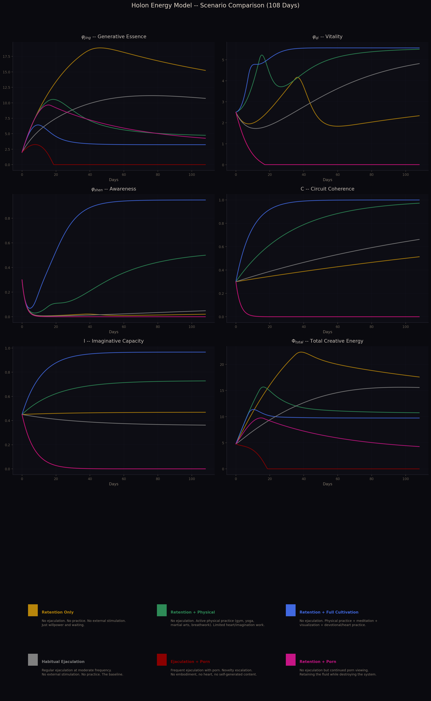

# Conservation Laws of a Creative Holon

## A Physics-Inspired Model of Sexual Energy, Vitality, and Awareness

---

## Context and Motivation

The Daoist tradition makes specific, structural claims about sexual energy. It asserts that the body contains a dense creative essence (jing) that can be refined into vitality (qi), which can be further refined into spiritual awareness (shen). It claims that excessive ejaculation depletes this essence, that retention conserves it, that specific practices transmute it upward through the body's energy centers, and that the resulting awareness constitutes a genuine expansion of consciousness -- not a metaphor, not a placebo, but a real transformation with observable consequences.

These are testable claims. If the Daoist framework describes something real about human energetic physiology, then we should be able to do what we do with any physical theory: formalize the assertions as mathematical relationships, build a dynamical model, simulate its behavior, and compare the predictions against observed reality.

That is what this document does.

The observed reality we're testing against is the massive, informal dataset generated by the NoFap and semen retention communities -- hundreds of thousands of practitioners reporting their experiences across a wide range of configurations. These reports are anecdotal, uncontrolled, and subject to every bias in the book. But they are also remarkably consistent in their broad structure:

- Retention produces rapid initial benefits (energy, clarity, confidence) that plateau around 30-60 days
- Retention without cultivation often deteriorates into agitation, obsessive ideation, and relapse after the initial gains
- Retention combined with physical practice (gym, martial arts, yoga) produces more stable and sustained benefits
- Retention combined with contemplative practice (meditation, breathwork, visualization) produces qualitatively different experiences -- described as "inner light," presence, spiritual aliveness
- Porn consumption degrades the benefits of retention even without ejaculation
- Recovery from chronic porn use is slow, with imaginative and creative capacity being the last thing to return

A simple reservoir model (stop draining, tank fills, benefits follow) cannot account for this pattern. It can't explain why retention sometimes makes people feel worse, why physical cultivation helps, why contemplative practice produces qualitatively different results, or why porn damages the system independently of ejaculation.

The Daoist three-phase model -- with its insistence that the intermediate phase (qi/vitality) is the obligate medium of transformation, that refinement requires specific internal conditions, and that the body's energy follows conservation and phase-transition dynamics -- can potentially account for all of it.

So let's build the model and find out.

The approach: take the core Daoist claims, express them as coupled differential equations with explicit phase-transition coefficients, simulate the dynamics under various configurations (retention, retention + cultivation, porn consumption, partnered practice), and compare the predicted trajectories against the phenomenology that practitioners actually report.

If the model's predictions match the observed pattern of experiences, that constitutes evidence (not proof, but evidence) that the Daoist framework is describing a real dynamical system. If the predictions diverge from observation, the model is wrong and the Daoist claims need revision or rejection.

The physics formalism is structural, not literal -- the quantities (φ_jing, φ_qi, φ_shen) are not measurable with current instruments. But the *relationships* between them are precise: conservation laws, phase transitions, threshold behavior, feedback loops. These relationships make specific, falsifiable predictions about what should happen under given conditions. A practitioner can test the model against their own experience and determine whether the dynamics match.

---

## I. State Variables and Parameters

### Phase Variables

Postulate: there exists a single substance -- call it **Φ** (divine creative energy) -- that manifests across a frequency spectrum within the holon (the fractal unit of a human body-consciousness). Φ exists in three phases, corresponding to the Daoist Three Treasures:

- **φ_jing** -- generative essence. The densest phase. Sexual energy, biological creative potential. Analogous to ice.
- **φ_qi** -- vitality. The intermediate phase. The animating current, felt aliveness, the energy that fuels action and engagement. Analogous to liquid water.
- **φ_shen** -- awareness. The subtlest phase. Consciousness, spiritual radiance, mental clarity. Analogous to steam.

These are three phases of one field: Φ = φ_jing + φ_qi + φ_shen.

**The critical role of φ_qi:** Vitality serves two distinct roles in the model that must not be conflated:

1. **Catalytic role (solvent).** φ_qi provides the *medium* in which phase transitions occur. Both the upward transmutation (jing -> qi -> shen) and downward re-infusion (shen -> qi -> jing) require adequate ambient φ_qi to proceed. This role is analogous to a solvent: it facilitates reactions without being consumed by them. Mathematically, it enters the transmutation coefficients as a saturating factor.

2. **Reactant role (feedstock).** φ_qi is also the *substrate* consumed by the second transmutation (qi -> shen). The κ₂ * φ_qi term in the equations represents first-order consumption kinetics: vitality is directly consumed to produce awareness.

These are different phenomena. The catalytic role means "low φ_qi slows all transitions." The reactant role means "the φ_qi -> φ_shen transition directly consumes φ_qi." Both are real. The model captures them with different mathematical structures.

### Infrastructure Variables

- **C** -- circuit coherence, in [0,1]. The integrity of the holon's internal wiring -- whether heart, body, intention, and awareness are connected in a functional circuit.
- **I** -- imaginative capacity, in [0,1]. The holon's ability to self-generate creative patterns without external input.

### Driving Variables (Practitioner-Controlled)

- **H** -- heart engagement, in [0,1]. How much the heart center is active in the circuit.
- **E** -- embodiment, in [0,1]. How much awareness is present in the body.
- **S** -- external stimulation, >= 0. Volume of externally consumed sexual/erotic content.
- **N** -- novelty escalation rate, >= 0. Rate of escalation from tolerance (not novelty per se).
- **G** -- generative fraction, in [0,1]. Fraction of creative/erotic content self-generated vs. externally consumed.
- **R_c** -- reciprocity, in [0,1]. Degree of genuine reciprocal exchange with another holon.
- **D_jing(t)** -- ejaculatory discharge, >= 0. Pulsed drain on φ_jing.
- **R_qi(t)** -- environmental support for vitality, >= 0. Sleep, nutrition, exercise contribution to φ_qi.
- **D_qi(t)** -- vitality drain from stress and overstimulation, >= 0. Chronic stress, emotional reactivity, and the metabolic cost of sustained arousal states drain φ_qi independently of the congestion mechanism.

---

## II. Endogenous Generation

The holon is not a battery. It is a spring.

A living body continuously produces φ_jing as an intrinsic function of being alive. This production is endogenous, always-on, and a defining property of the living holon.

Define the **effective endogenous generation rate**:

```
Γ_eff = Γ₀ * p(φ_qi)
```

Where:

- **Γ₀** is the constitutional baseline generation rate (varies by individual -- age, genetics, overall health). Γ₀ > 0 as long as the holon is alive.
- **p(φ_qi)** is a vitality-modulation function that captures the dependence of jing production on system health:

```
p(φ_qi) = p_min + (1 - p_min) * φ_qi / (φ_qi + K_p)
```

p_min > 0 is a small floor (generation never fully ceases in a living system, but can be severely suppressed). K_p is the half-saturation constant. When φ_qi is healthy, p ≈ 1 and Γ_eff ≈ Γ₀. When φ_qi is severely depleted, p → p_min and Γ_eff drops to Γ₀ * p_min.

This creates a feedback loop absent from a constant-Γ model: chronic φ_qi depletion reduces Γ_eff, which reduces the feedstock for κ₁, which further reduces φ_qi replenishment from below. This is the "death spiral" of severe chronic illness or extreme burnout, where the body's regenerative capacity itself degrades.

The spring always flows, but the flow rate depends on the health of the aquifer.

---

## III. The Phase Equations

The phase equations are the primary dynamical specification. All aggregate quantities are derived from them.

```
dφ_jing/dt = Γ_eff - (κ₁_eff + λ_jing) * φ_jing + μ₁ * φ_qi - D_jing(t)

dφ_qi/dt   = κ₁_eff * φ_jing - (μ₁ + κ₂_eff + λ_qi) * φ_qi + μ₂ * φ_shen
             + R_qi(t) - D_qi(t) - σ * max(0, φ_jing - φ_jing_eq) * φ_qi

dφ_shen/dt = κ₂_eff * φ_qi - (μ₂ + λ_shen) * φ_shen
```

### Verification: Conservation Consistency

Summing all three equations yields:

```
dΦ/dt = Γ_eff - λ_jing * φ_jing - λ_qi * φ_qi - λ_shen * φ_shen
        + R_qi(t) - D_jing(t) - D_qi(t) - σ * max(0, φ_jing - φ_jing_eq) * φ_qi
```

Note that all κ and μ terms cancel in the sum -- as they must, since transmutation and re-infusion redistribute Φ between phases without creating or destroying it. The only terms that survive are sources (Γ_eff, R_qi), sinks (D_jing, D_qi, the congestion drain), and dissipation (the three λ terms). This is the model's conservation law: Φ changes only through generation, environmental support, discharge, dissipation, and congestion stress. Internal phase transitions are conservative.

(Exchange terms X(t) would also survive the sum; they are treated separately in Section VIII.)

### Design Choices and Their Justifications

**R_shen is absent.** The φ_shen equation has no environmental source term. This is a deliberate modeling choice reflecting the Daoist claim that awareness cannot be acquired directly from the environment -- it must be transmuted from vitality through functioning infrastructure. You cannot eat, sleep, or supplement your way to shen. You must refine it from qi. If this claim is wrong -- if, say, exposure to nature or music directly produces φ_shen -- then an R_shen term should be added, but this would weaken the obligate-intermediate architecture that gives the model its predictive structure.

**The congestion coupling term: -σ * max(0, φ_jing - φ_jing_eq) * φ_qi.** This is the mechanism by which untransmuted dense energy drains vitality. When φ_jing exceeds its natural equilibrium level φ_jing_eq (defined below in steady-state analysis), the excess creates agitation -- restlessness, obsessive ideation, physiological stress -- that is metabolically expensive and consumes φ_qi. The drain is proportional to both the excess (more congestion = more stress) and the available vitality (you can't drain what isn't there). σ is the congestion-stress coefficient. This term creates the positive feedback loop between congestion and vitality depletion that drives the "retention without cultivation deteriorates" prediction. Without it, this prediction -- one of the model's most important -- would not follow from the equations.

**μ₁ and μ₂ are infrastructure-independent.** The upward transmutation coefficients κ₁ and κ₂ depend on circuit coherence C and imaginative capacity I, because transmutation is an *anti-entropic* process -- it refines dense energy into subtle energy, which is thermodynamically uphill and requires active work by the system's infrastructure. Re-infusion (μ₁, μ₂) is the reverse: subtle energy condensing into denser forms, which is thermodynamically *downhill* -- entropically favored. A fragmented system can still "cool" its energy from subtle to dense; it just can't "heat" it from dense to subtle. This is analogous to how heat flows spontaneously from hot to cold but requires a heat engine (infrastructure) to flow from cold to hot. Accordingly, μ₁ and μ₂ are treated as constants independent of C and I.

---

## IV. The Transmutation Coefficients

### The Catalytic Dependency on φ_qi

Both transmutation coefficients require adequate ambient vitality to proceed. This is the solvent/catalytic role of φ_qi -- distinct from its reactant role -- captured by saturating functions:

```
f(φ_qi) = f_min + (1 - f_min) * φ_qi / (φ_qi + K_f)
g(φ_qi) = g_min + (1 - g_min) * φ_qi / (φ_qi + K_g)
```

The floor terms f_min, g_min > 0 are critical. They ensure that the transmutation coefficients never reach exactly zero, which resolves the **bootstrap problem**: if f were allowed to reach zero at φ_qi = 0, the system would have an absorbing state from which no recovery is possible -- κ₁_eff = 0 means no new φ_qi can be produced from jing, and the system is permanently stuck. The floor ensures that even at severely depleted φ_qi, a trickle of transmutation occurs. Combined with R_qi (environmental vitality support from food, sleep, breath), this trickle is sufficient to gradually rebuild φ_qi from near-zero. The system is recoverable from any non-death state.

The floor values should be small (f_min, g_min ~ 0.01-0.05) -- transmutation at near-zero vitality is very slow, but not impossible. This matches the phenomenology of recovery from severe depletion: progress is initially glacial, then accelerates as φ_qi rebuilds and f, g climb toward 1.

### The Full Coefficients

```
κ₁_eff = κ₁₀ * C^α₁ * I^β₁ * f(φ_qi)
κ₂_eff = κ₂₀ * C^α₂ * I^β₂ * g(φ_qi)
```

Where:

- κ₁₀, κ₂₀ are baseline transmutation capacities (constitutional, vary by individual)
- α₁, α₂ > 1 make both coefficients superlinear in circuit coherence
- β₁, β₂ > 1 make both coefficients superlinear in imaginative capacity
- f(φ_qi), g(φ_qi) are the saturating catalytic functions defined above

**Key asymmetry:** The second transition is more demanding:

- κ₂₀ < κ₁₀ -- lower baseline rate
- α₂ > α₁ -- more sensitive to circuit coherence
- β₂ > β₁ -- more sensitive to imaginative capacity

It's easier to convert sexual energy into vitality than to convert vitality into awareness. The first transition responds to basic practices. The second requires refined infrastructure.

### Superlinearity and Threshold Behavior

The exponents α, β > 1 produce **threshold behavior**: κ₁_eff and κ₂_eff don't decline linearly as C and I degrade -- they collapse. Small degradations produce outsized reductions. There is a critical region below which transmutation effectively stalls (though it never reaches exactly zero, thanks to the f_min, g_min floors). These thresholds are formally defined in the steady-state analysis below.

---

## V. The Infrastructure Dynamics

### Circuit Coherence

```
dC/dt = h * H * E * (1 - C) - δ_ext * S * (1 - E) * C - δ_nov * N * C + ρ * R_c * (1 - C)
```

All degradation terms now include a factor of C: you can only degrade coherence you actually have. This ensures C ∈ [0,1] is respected by the dynamics -- at C = 0, the degradation terms vanish (no coherence to lose), but the growth terms h * H * E and ρ * R_c remain positive, so C = 0 is **not** an absorbing boundary: the system can recover from zero coherence through heart-engaged embodied practice or reciprocal connection. C = 0 is absorbing only when H * E = 0 and R_c = 0 simultaneously -- complete absence of both heart-embodied practice and reciprocity. C = 1 is bounded by the (1 - C) factors on the growth terms. The equation is well-posed on [0,1].

Term by term:

- **h * H * E * (1 - C)**: Coherence builds when heart is engaged and experience is embodied. Bounded by (1 - C).
- **-δ_ext * S * (1 - E) * C**: External stimulation without embodiment degrades existing coherence. The C factor ensures degradation vanishes as coherence approaches zero.
- **-δ_nov * N * C**: Novelty escalation degrades existing coherence. No compensating factor beyond the C floor -- escalation from tolerance is always destructive.
- **ρ * R_c * (1 - C)**: Reciprocity builds coherence. Bounded by (1 - C) to prevent C > 1.

### Imaginative Capacity

```
dI/dt = ε * G * (1 - I) - ω * S * I - δ_I * (1 - G) * I
```

Well-posed on [0,1]: the growth term vanishes at I = 1 and the decay terms vanish at I = 0.

Term by term:

- **ε * G * (1 - I)**: Imagination builds when the holon self-generates its creative content. Like a muscle -- use it and it grows.
- **-ω * S * I**: External stimulation consumption atrophies imagination. Exponential decay under sustained consumption.
- **-δ_I * (1 - G) * I**: Disuse atrophy. Imagination decays not only from active damage (external stimulation) but also from simple neglect. When G < 1, the imaginative faculty is not being fully exercised, and it weakens -- like a muscle that atrophies from disuse, not just from injury. When G = 1, this term vanishes. This captures a crucial asymmetry in recovery: stopping external stimulation (S = 0) is necessary but not sufficient. The practitioner must *actively exercise* the faculty (G → 1), not merely abstain from damaging it.

---

## VI. Steady-State Analysis

Setting all time derivatives to zero reveals the equilibrium structure of the system.

### Simplified Steady State (No Discharge, No Congestion, No Exchange)

For analytic tractability, consider the core system with D = 0, R_qi = 0, σ = 0, and infrastructure at steady values C*, I*. The phase equations become:

```
0 = Γ_eff - (κ₁* + λ_jing) * φ_jing* + μ₁ * φ_qi*

0 = κ₁* * φ_jing* - (μ₁ + κ₂* + λ_qi) * φ_qi* + μ₂ * φ_shen*

0 = κ₂* * φ_qi* - (μ₂ + λ_shen) * φ_shen*
```

Where κ₁* = κ₁_eff(C*, I*, φ_qi*) and κ₂* = κ₂_eff(C*, I*, φ_qi*).

From the third equation:

```
φ_shen* = κ₂* * φ_qi* / (μ₂ + λ_shen)
```

Substituting into the second:

```
φ_qi* = κ₁* * φ_jing* / (μ₁ + κ₂* + λ_qi - μ₂ * κ₂* / (μ₂ + λ_shen))
```

Define the effective qi drain rate:

```
Λ_qi = μ₁ + λ_qi + κ₂* * λ_shen / (μ₂ + λ_shen)
```

Then:

```
φ_qi* = κ₁* * φ_jing* / Λ_qi
```

And from the first equation:

```
φ_jing* = (Γ_eff + μ₁ * φ_qi*) / (κ₁* + λ_jing)
```

Substituting the φ_qi* expression and solving:

```
φ_jing* = Γ_eff / (κ₁* + λ_jing - μ₁ * κ₁* / Λ_qi)
         = Γ_eff * Λ_qi / (κ₁* * Λ_qi + λ_jing * Λ_qi - μ₁ * κ₁*)
         = Γ_eff * Λ_qi / (κ₁* * (Λ_qi - μ₁) + λ_jing * Λ_qi)
```

Since Λ_qi - μ₁ = λ_qi + κ₂* * λ_shen / (μ₂ + λ_shen) > 0 and λ_jing > 0, the denominator is positive and the equilibrium exists.

### The Natural Equilibrium Level

In the limit where κ₁* is small (minimal transmutation), the jing equilibrium reduces to:

```
φ_jing_eq ≈ Γ_eff / λ_jing
```

This is the **natural equilibrium level** -- the steady state of φ_jing when the spring (Γ_eff) is balanced only by natural dissipation (λ_jing). It is finite, not infinite. Under retention without cultivation, φ_jing rises toward this level, not toward infinity. The congestion term in the φ_qi equation uses this as the reference: congestion stress occurs when φ_jing exceeds φ_jing_eq, which happens transiently during the accumulation phase or when environmental conditions (e.g., porn-induced arousal) drive φ_jing above its natural resting point.

Note: φ_jing_eq = Γ_eff / λ_jing can still be *uncomfortably high*. If λ_jing is small (dense energy is durable), the equilibrium level may be large enough to produce significant congestion pressure even though it is mathematically bounded. The phenomenology of escalating discomfort under retention is real -- it's the approach to a high equilibrium, not unbounded growth.

A subtlety: φ_jing_eq is itself a *moving target*. Since Γ_eff depends on φ_qi through the p(φ_qi) modulation, a decline in vitality lowers Γ_eff, which lowers φ_jing_eq, which means congestion kicks in at a *lower* φ_jing level. This creates an additional positive feedback loop beyond the direct congestion-vitality coupling: φ_qi drops → Γ_eff drops → φ_jing_eq drops → congestion activates sooner → φ_qi drops further. This amplifies the "death spiral" dynamics of severe depletion and means that a holon experiencing chronic vitality drain becomes progressively more congestion-sensitive even without changes in φ_jing.

### Formal Threshold Definitions

**The κ₁ threshold** is the minimum value of κ₁_eff at which the system sustains φ_qi above a functional minimum φ_qi_min (the level at which vitality is experientially adequate):

```
κ₁_eff > κ₁_thresh = Λ_qi * φ_qi_min * (κ₁_eff + λ_jing) / (Γ_eff + μ₁ * φ_qi_min)
```

This is an implicit inequality (κ₁_eff appears on both sides), but for κ₁_eff << λ_jing it simplifies to:

```
κ₁_thresh ≈ Λ_qi * φ_qi_min * λ_jing / Γ_eff
```

This reveals the controlling ratios: the threshold is higher when φ_qi drains faster (large Λ_qi), when the minimum viable vitality is higher (large φ_qi_min), and when the source flux is weaker (small Γ_eff/λ_jing). A constitutionally vigorous holon (high Γ_eff, low λ_jing) has a lower threshold -- it can sustain adequate vitality with less infrastructure.

**The κ₂ threshold** is the minimum value of κ₂_eff at which the system sustains φ_shen above a functional minimum φ_shen_min (the level at which awareness is experientially present):

```
κ₂_thresh = (μ₂ + λ_shen) * φ_shen_min / φ_qi*
```

Since φ_qi* itself depends on κ₁_eff, this threshold can only be crossed when κ₁ is already above *its* threshold -- confirming the staircase structure. You must cross κ₁_thresh before κ₂_thresh becomes crossable.

### Stability

The Jacobian of the simplified three-phase system (ignoring the κ dependence on φ_qi for local analysis) has eigenvalues with negative real parts whenever all λ, κ, μ > 0 -- the equilibrium is a locally stable node. Perturbations decay exponentially in a neighborhood of the steady state. This means the model predicts *return to equilibrium* after disruption, with timescales set by the eigenvalues. The slowest eigenvalue (smallest |Re(λ)|) determines the system's recovery time -- this is dominated by the smallest of (λ_jing, effective qi drain rate, effective shen drain rate).

---

## VII. Dimensionless Analysis

The model has many parameters. Nondimensionalization reveals which combinations actually control the dynamics.

**Natural scales:**

- Energy: φ₀ = Γ₀ / λ_jing (the natural jing equilibrium under zero transmutation)
- Time: τ = 1 / λ_qi (the vitality dissipation timescale -- the "middle clock")

**Dimensionless state variables:**

```
j = φ_jing / φ₀,    q = φ_qi / φ₀,    s = φ_shen / φ₀
```

**Key dimensionless groups:**

```
r_slow  = λ_jing / λ_qi       ratio of jing to qi dissipation (< 1: jing is more durable)
r_fast  = λ_shen / λ_qi       ratio of shen to qi dissipation (> 1: shen is more volatile)
K₁      = κ₁₀ / λ_qi          dimensionless first transmutation rate
K₂      = κ₂₀ / λ_qi          dimensionless second transmutation rate
M₁      = μ₁ / λ_qi           dimensionless first re-infusion rate
M₂      = μ₂ / λ_qi           dimensionless second re-infusion rate
Σ       = σ * φ₀ / λ_qi       dimensionless congestion-stress coefficient
```

The system's behavior is governed by these seven dimensionless ratios (plus the infrastructure exponents α₁, α₂, β₁, β₂ and the saturation parameters). This is a significant reduction from the ~20 raw parameters.

**What the dimensionless groups reveal:**

- **r_slow << 1** means jing is much more durable than qi. The dense reservoir changes slowly relative to vitality -- consistent with the observation that sexual energy is the most resilient treasure.
- **r_fast >> 1** means shen dissipates much faster than qi. Spiritual clarity is the most fragile state -- consistent with the universal observation that meditative insight is hard to maintain.
- **K₁ vs K₂** controls the relative ease of the two transitions. K₂ < K₁ means the second transition is intrinsically harder.
- **Σ** controls how aggressively congestion drains vitality. If Σ is large, even modest jing excess above equilibrium causes significant qi drain. If Σ is small, the holon tolerates congestion better.

**Natural timescales (in dimensional units):**

- Jing recovery: τ_jing = 1/λ_jing = τ/r_slow (slowest -- days to weeks)
- Qi recovery: τ_qi = 1/λ_qi = τ (medium -- weeks)
- Shen recovery: τ_shen = 1/λ_shen = τ/r_fast (fastest dissipation, but slowest *production* because it requires functioning infrastructure)

The paradox of shen: it dissipates fastest but recovers slowest. This is because dissipation is passive (governed by λ_shen) but production is active (governed by κ₂_eff, which requires infrastructure). Fast dissipation + slow production = the most fragile treasure.

---

## VIII. The Exchange Term: Partnered Practice

The claim that X(t) > 0 for both partners simultaneously requires formal justification.

**Model:** When two holons interact in sacred partnered practice, they generate a shared coherence field Ψ that feeds back into each holon's φ_qi:

```
Ψ = γ * sqrt(φ_qi_A * φ_qi_B) * C_A * C_B * H_A * H_B
```

Where γ is a coupling constant and A, B index the two holons. The exchange term for each holon is:

```
X_qi_A = η * Ψ,     X_qi_B = η * Ψ
```

Where η > 0 is the absorption efficiency.

**Why this is non-zero-sum:** The total system energy changes by:

```
dΦ_total/dt includes: X_qi_A + X_qi_B = 2η * Ψ > 0
```

The "extra" energy comes from the coherence of the interaction itself -- the geometric mean sqrt(φ_qi_A * φ_qi_B) is maximized when the two φ_qi values are equal and positive (balanced exchange), and the C * H products ensure the energy only flows when both holons have intact, heart-open circuits. This is analogous to constructive wave interference: two coherent waves produce a combined amplitude that exceeds the sum of individual amplitudes. The coherence condition (both C and H high in both partners) is the "phase-matching" requirement.

This formalization makes the non-zero-sum prediction contingent on specific conditions: both partners must have adequate φ_qi, both must have intact circuits (C > 0), and both must have heart engagement (H > 0). If any of these fail, Ψ → 0 and the exchange vanishes. Casual or disconnected sex produces no resonance bonus.

**Simplification noted:** The model routes all exchange through φ_qi. A natural generalization would include phase-specific exchange terms -- X_jing (physical resonance), X_qi (vitality exchange), X_shen (shared meditative states) -- reflecting the observation that different partnered practices emphasize different phases: physical practices emphasize X_jing, heart-centered practices emphasize X_qi, and shared contemplative practice emphasizes X_shen. The qi-only model captures the dominant mechanism (since φ_qi is the rate-limiting reagent) but may underestimate the benefits of practices that directly exchange dense or subtle energy.

---

## IX. Applying the Model: The Retention Spectrum

### Pure Retention, No Cultivation

```
D = 0, S = 0, N = 0, H ~ 0, E ~ 0.5, G ~ 0.5
No breathwork, no meditation, no physical practice beyond baseline.
Γ_eff ≈ Γ₀ (assuming adequate φ_qi initially).
```

**The "superpowers" transient, explained mechanistically:**

The initial benefits of retention require explanation: the reported experiences (confidence, clarity, social magnetism) are phenomenologically associated with φ_qi and φ_shen, not φ_jing. If κ₁_eff is moderate, how does jing accumulation produce qi-level and shen-level effects?

The answer is in the *product* κ₁_eff * φ_jing. Under habitual ejaculation, φ_jing oscillates near a low steady state. When discharge stops, φ_jing begins rising roughly as:

```
φ_jing(t) ≈ φ_jing_eq * (1 - e^(-λ_jing * t))
```

approaching its equilibrium exponentially from below. The flux of φ_qi production is κ₁_eff * φ_jing(t), which rises in proportion. Even if κ₁_eff is small, the *increase* in this flux relative to the pre-retention baseline is significant -- the flux may double or triple from its chronically-depleted baseline.

This transient increase in φ_qi production generates a *surplus* of vitality above the chronic baseline. Some of this surplus transmutes further via κ₂_eff into φ_shen (even a small κ₂_eff applied to above-baseline φ_qi produces above-baseline φ_shen). The practitioner experiences this surplus as increased vitality, mental clarity, and confidence.

**The plateau and reversal:**

The surplus is transient because φ_jing is approaching a *finite* equilibrium (φ_jing_eq = Γ_eff / λ_jing). As φ_jing nears equilibrium, its growth rate declines, the flux increase saturates, and the transient surplus dissipates. The system settles into a new steady state where the φ_qi level is modestly higher than the pre-retention baseline -- but not dramatically so, because κ₁_eff was never large enough to convert most of the accumulated φ_jing.

Meanwhile, congestion effects begin. As φ_jing rises above the level that the system is equipped to process (i.e., above what κ₁_eff can transmute at the rate Γ_eff produces), the congestion term -σ * max(0, φ_jing - φ_jing_comfortable) * φ_qi activates. This begins draining φ_qi -- partially or fully offsetting the modest gains from improved κ₁_eff * φ_jing flux. The practitioner feels the vitality surplus eroding, replaced by agitation from the untransmutable excess.

**The model predicts:** Initial benefits that are real, peak at roughly the timescale τ_jing ~ 1/λ_jing (days to weeks), then plateau and potentially reverse as the system settles near a high-jing steady state with congestion. This matches the 30-60 day plateau followed by agitation that the retention community widely reports.

### Retention with Physical Cultivation

```
D = 0, S = 0, N = 0, H ~ 0.3, E ~ 0.8, G ~ 0.6
Active breathwork, physical practice, some embodied awareness.
Γ_eff ≈ Γ₀.
```

**The change:** E = 0.8 strengthens the h * H * E * (1 - C) growth term in dC/dt. C begins building. R_qi is elevated (physical practice directly supports vitality). With rising C, κ₁_eff increases superlinearly. More importantly, the higher κ₁_eff * φ_jing flux efficiently converts the accumulated jing into qi, relieving congestion pressure.

**The result:** φ_jing transmutes into φ_qi efficiently. The congestion term stays small because φ_jing doesn't accumulate far beyond what κ₁_eff can process. The practitioner feels sustained vitality, physical vigor, creative energy, emotional stability.

**The limitation:** κ₂_eff may remain below threshold. Physical practice builds E but not necessarily H (heart engagement) or I (imagination). With α₂ > α₁ and β₂ > β₁, the second transition is more demanding. The practitioner reaches the **vitality-only regime** -- the "healthy animal" plateau.

**The model predicts:** Stable, sustainable benefits with no congestion. A ceiling on development that physical cultivation alone can't break through. This matches the experience of practitioners who combine retention with gym/sports/martial arts -- they feel great but report that "something more" remains inaccessible.

### Retention with Full Cultivation

```
D = 0, S = 0, N = 0, H ~ 0.8, E ~ 0.9, G ~ 0.9, R_c ~ 0 (solo)
Breathwork, physical practice, meditation, visualization, devotional practice.
Γ_eff ≈ Γ₀.
```

All infrastructure variables are being actively developed. Both κ₁_eff and κ₂_eff cross their respective thresholds.

**The result:** Full three-phase circulation. φ_jing transmutes to φ_qi, φ_qi transmutes to φ_shen, φ_shen re-infuses φ_qi via μ₂ (grace organizing vitality), φ_qi re-infuses φ_jing via μ₁ (vitality nourishing the base). The holon breathes.

**The accelerating returns:** Once κ₂_eff crosses threshold, a positive feedback loop activates. φ_shen production improves the felt quality of awareness, which supports more refined practice, which builds C and I further, which increases κ₂_eff, which produces more φ_shen. The superlinear exponents mean this is self-reinforcing once it crosses the threshold. This is the exponential growth phase that serious practitioners describe -- not linear progress, but threshold-crossing followed by accelerating coherence.

### Habitual Ejaculation, No External Stimulation

```
D_jing > 0 (periodic), S = 0, N = 0, H ~ 0.1, E ~ 0.5, G ~ 0.7
Γ_eff ≈ Γ₀.
```

φ_jing oscillates around a steady state where Γ_eff roughly balances D_jing + (κ₁_eff + λ_jing) * φ_jing. With low C and I, κ₁_eff is small, so most of the Γ_eff production is lost to discharge and dissipation rather than transmuted.

φ_qi is maintained at biological baseline by R_qi (food, sleep, metabolism). φ_shen is near zero -- κ₂_eff is far below threshold.

**The model predicts:** The baseline human condition. Sexually active, physically functional, spiritually dormant. Treading water. The spring flows, fills the pool to a steady state, and that's it.

### Habitual Ejaculation with Porn

```
D_jing > 0 (frequent), S = high, N = escalating, G = 0, H ~ 0, E ~ 0.1
Γ_eff ≈ Γ₀ (initially).
```

Everything from the previous scenario, plus active infrastructure degradation. dC/dt is strongly negative (δ_ext * S * (1-E) * C + δ_nov * N * C terms dominating). dI/dt is strongly negative (ω * S * I producing exponential decay).

φ_jing is chronically low (frequent discharge, though Γ_eff keeps it from zero). φ_qi is declining from stress/overstimulation drain (D_qi) and from inability to replenish via κ₁ from below. φ_shen is absent.

Over the long term, if φ_qi drops far enough, Γ_eff itself begins declining via the p(φ_qi) modulation -- the death spiral where the spring weakens because the aquifer is depleted.

**The model predicts:** Progressive decline across all axes. The practitioner falls through both thresholds. Eventually Γ_eff is the only significant positive term in the system.

**Recovery note:** Γ_eff never reaches zero (p_min > 0). The moment D, S, and N are set to zero, φ_jing begins accumulating immediately. The initial NoFap gains are fast because they're just unblocking a perpetual (if weakened) spring. The harder work is rebuilding C and I, which don't recover just because consumption stopped.

### Retention with Porn

```
D_jing = 0, S = high, N = escalating, G = 0, H ~ 0, E ~ 0.1
Γ_eff ≈ Γ₀.
```

The configuration the model most urgently warns about.

Γ_eff is running. D = 0. φ_jing rises toward φ_jing_eq = Γ_eff / λ_jing -- a finite but potentially high level. But κ₁_eff is collapsing (C and I in free fall). The transmutation capacity can't keep up with the accumulation.

As φ_jing rises above what κ₁_eff can process, the congestion term activates, draining φ_qi. Meanwhile φ_qi is *also* being drained by the agitation of the porn trance itself (D_qi from overstimulation). The solvent is attacked from two directions.

Three simultaneous failure modes:

1. **Dense congestion**: φ_jing rising toward a high equilibrium with inadequate κ₁_eff to process it
2. **Intermediate depletion**: φ_qi draining from congestion stress + overstimulation without replenishment from below
3. **Subtle starvation**: φ_shen inaccessible (κ₂_eff ≈ 0 and insufficient φ_qi feedstock)

Plus infrastructure destruction in the background -- even if the practitioner stops viewing, the κ coefficients won't recover without sustained rebuilding.

**The model predicts:** On a long enough timescale, worse than porn with ejaculation. Ejaculation at least relieves the congestion pressure (reducing the σ term). Here, the pressure builds toward the high equilibrium while the solvent depletes and infrastructure degrades. This predicts escalating agitation, obsessive ideation, and eventual forced relapse -- the system becomes so pressurized that it overwhelms willpower.

### Sacred Partnered Practice with Retention

```
D = 0, S = 0, N = 0, H = 1, E = 1, R_c = 1, G = 1
Both partners generating, exchanging, circulating.
Γ_eff ≈ Γ₀ (both holons).
```

The unique feature: the exchange term X_qi = η * Ψ > 0 for both partners. φ_qi is supplemented from below (κ₁_eff * φ_jing) AND from the resonance field (η * Ψ). This directly feeds the solvent layer -- the rate-limiting reagent in every other configuration.

**The model predicts:** Maximum generation, maximum coherence, maximum development. The resonance amplification supplements φ_qi, which is the bottleneck everywhere else. This is why sacred partnered practice is consistently described across traditions as more powerful than solo practice.

---

## X. Key Predictions

### 1. The spring is bounded but high.

Γ_eff > 0 always. φ_jing under retention approaches Γ_eff / λ_jing -- finite, not infinite, but potentially uncomfortably high. Initial retention gains are fast and reliable because the spring was always flowing. Congestion is real but bounded.

### 2. Infrastructure dominates reservoir.

The transmutation coefficients κ = κ₀ * C^α * I^β * f(φ_qi) mean infrastructure variables dominate productive capacity. A holon with moderate φ_jing but high C and I outperforms a holon with high φ_jing but degraded C and I. Obsessing over retention while ignoring circuit coherence and imaginative capacity is optimizing the wrong variable.

### 3. Two critical thresholds exist and are formally computable.

κ₁_thresh and κ₂_thresh are defined by the steady-state inequalities. They sit at different positions in the C x I space because κ₂ is more sensitive to both variables. The most common state is above κ₁_thresh but below κ₂_thresh: physically vital, spiritually dormant. The "healthy animal" regime.

### 4. The vitality bottleneck is the hidden failure mode.

φ_qi depletion collapses both κ coefficients via the catalytic dependency AND suppresses Γ_eff via the generation modulation. The modern epidemic is low φ_qi: screen time, chronic stress, sleep deprivation, sedentary lifestyles all drain the intermediate reservoir. The transmutation pathway may be intact but has no medium to operate in.

### 5. Imagination is the bottleneck for the higher transition.

β₂ > β₁ means I affects κ₂ more than κ₁. The imaginative faculty used in erotic visualization and in contemplative practice are the same faculty. Outsourcing it atrophies the capacity for the φ_qi -> φ_shen transition across all domains.

### 6. Congestion drains vitality via an explicit feedback loop.

The -σ * max(0, φ_jing - φ_jing_eq) * φ_qi term creates a positive feedback loop: congestion -> φ_qi drain -> lower κ₁_eff (via catalytic dependency) -> worse congestion -> more φ_qi drain. This is why retention without cultivation becomes increasingly uncomfortable rather than plateauing comfortably at equilibrium.

### 7. Novelty escalation is a pure coherence tax.

-δ_nov * N * C always degrades coherence. No compensating factor. Structurally incompatible with coherence maintenance regardless of other variables.

### 8. Reciprocity is non-zero-sum under formally specified conditions.

The shared field Ψ = γ * sqrt(φ_qi_A * φ_qi_B) * C_A * C_B * H_A * H_B produces X_qi > 0 for both partners when C, H, and φ_qi are adequate in both. The non-zero-sum property derives from the geometric mean structure of the coupling. It vanishes when coherence, heart engagement, or vitality fails in either partner.

---

## XI. The Phase Diagram

The true phase space is five-dimensional (φ_jing, φ_qi, φ_shen, C, I). The thresholds are *surfaces* in this space, not lines. The one-dimensional diagram below is a projection onto a composite axis that assumes C, I, and φ_qi co-vary, which is approximately true for the scenarios analyzed but not universally valid -- the model permits states like "high φ_qi with low I" (physically vital but imaginatively atrophied) that don't fall on this axis.

```
                        high C, high I, adequate φ_qi
                              |
              FULL CIRCULATION |
                REGIME         |  κ₁_eff > κ₁_thresh AND κ₂_eff > κ₂_thresh
                               |  All three phases in dynamic equilibrium
                               |  Clarity, presence, inner radiance
             ..................|.................  <-- κ₂ threshold surface
                               |
              VITALITY-ONLY    |  κ₁_eff > κ₁_thresh, κ₂_eff < κ₂_thresh
                REGIME         |  φ_jing -> φ_qi works, φ_qi -> φ_shen stalled
                               |  The "healthy animal" plateau
             ..................|.................  <-- κ₁ threshold surface
                               |
              DISSIPATIVE      |  κ₁_eff < κ₁_thresh
                REGIME         |  Neither transition sustains functional output
                               |  Dense congestion or depletion, system fragmenting
                              |
                        low C, low I, depleted φ_qi
```

A more informative representation would project onto the C-I plane at fixed φ_qi, drawing the κ₁ and κ₂ threshold curves as iso-contours. Since κ_eff = κ₀ * C^α * I^β * f(φ_qi), the threshold curves are:

```
C^α₁ * I^β₁ = κ₁_thresh / (κ₁₀ * f(φ_qi))    [κ₁ threshold curve]
C^α₂ * I^β₂ = κ₂_thresh / (κ₂₀ * g(φ_qi))    [κ₂ threshold curve]
```

These are power-law curves in the C-I plane. Because α₂ > α₁ and β₂ > β₁, the κ₂ curve sits above and to the right of the κ₁ curve -- requiring higher C and I. As φ_qi decreases, both curves shift outward (higher C, I required), consistent with the vitality bottleneck prediction.

---

## XII. Recovery Dynamics

The model predicts asymmetric recovery timescales:

| Variable | Recovery Driver | Timescale | Notes |
|----------|----------------|-----------|-------|
| φ_jing | Γ_eff (always on) + retention | ~1/λ_jing | Fastest. Close the drain. Spring was always flowing. |
| φ_qi | R_qi + κ₁_eff flux from below | ~1/λ_qi | The actual bottleneck. Requires both environmental support AND functioning κ₁. |
| φ_shen | κ₂_eff flux from φ_qi | ~1/λ_shen for dissipation, but production timescale is ~1/κ₂_eff which can be very long | Cannot be replenished directly. Must be transmuted through functioning infrastructure. |
| C | h * H * E * (1-C) growth | ~1/(h*H*E) | Decelerates as C increases. |
| I | ε * G * (1-I) growth | ~1/(ε*G) | **Slowest.** Requires active self-generation (G ~ 1), not just abstinence from consumption. |

**The recovery sequence:**

1. **Close the drain.** D = 0, S = 0, N = 0. φ_jing accumulates from Γ_eff. This is where fast initial gains come from.
2. **Refill the solvent.** Sleep, nutrition, exercise, breathwork, stress reduction. Rebuild φ_qi via R_qi. This supports Γ_eff (via the p(φ_qi) modulation) and enables κ₁_eff (via the catalytic dependency).
3. **Rebuild C.** Heart-open, embodied presence. This is where most retention practitioners stop, yielding the vitality-only plateau.
4. **Rebuild I.** Active imagination exercises -- visualization, creative practice, meditation with internal imagery. The key is self-generated content with no external input. Slowest step.
5. **Cross κ₁ threshold.** Sustained vitality, not just sexual pressure.
6. **Cross κ₂ threshold.** Clarity, presence, inner radiance as stable states.
7. **Full circulation.** The holon breathes at all three levels. Γ_eff feeds the cycle continuously.

Full recovery is possible -- all variables are bounded with no permanent damage ceiling. The bootstrap problem is resolved by the f_min floor on κ₁_eff and the R_qi environmental support term. But timescales stack, and the total arc from deep depletion to full circulation is measured in years.

---

## XIII. Simulation Results

The model was implemented as a coupled ODE system in Python (scipy.integrate.solve_ivp, LSODA integrator) and simulated across six practitioner scenarios for 108 days. This timescale was chosen for two reasons: practically, it spans the critical window where retention practitioners report the full arc from initial gains through plateau to either sustained benefit or deterioration (most reports describe decisive divergence between 60-90 days). The number 108 also carries significance in Buddhist and Daoist contemplative traditions (108 mala beads, 108 energy channels), making it a natural period for a model rooted in these frameworks.

All six scenarios start from identical initial conditions representing a chronic baseline: moderate φ_jing, moderate φ_qi, low φ_shen, low circuit coherence (C = 0.30), and moderate imaginative capacity (I = 0.45). The scenarios differ only in the practitioner-controlled driving variables: discharge rate, external stimulation, heart engagement, embodiment, generative fraction, and environmental vitality support.



### What the simulation confirms

**The "superpowers" transient is visible.** In the Retention Only scenario (gold), φ_qi spikes briefly around day 10-15 as the κ₁_eff * φ_jing flux increases -- the transient vitality surplus that produces the early benefits. It then declines as φ_jing saturates and the congestion coupling term begins draining vitality. By day 108, the Retention Only practitioner has *less* vitality than their starting baseline, despite accumulating φ_jing to 12.5. The spring is flowing. The pool is full. But the congestion is eating the solvent.

**The three retention tiers separate cleanly.** Retention Only (gold) accumulates jing but loses vitality and awareness. Retention + Physical (green) efficiently transmutes jing into vitality (strong κ₁_eff) but produces only modest awareness -- the vitality-only plateau is visible as the gap between the green and blue curves in the φ_shen panel. Retention + Full Cultivation (blue) produces strong and still-accelerating awareness at day 108 -- the κ₂ threshold crossing is visible as the inflection point around day 30 where the blue φ_shen curve bends upward.

**Infrastructure divergence drives outcome divergence.** The I (Imaginative Capacity) panel tells the real story. Full Cultivation pushes I to 0.93. Physical Cultivation stabilizes at 0.57. Retention Only declines to 0.31. The baseline and porn scenarios collapse. Since κ₂_eff depends superlinearly on I (exponent β₂ = 2.0), these I differences produce *enormous* differences in the φ_qi -> φ_shen transmutation rate. The infrastructure is where the trajectories diverge, not the reservoir.

**Porn destroys the system on the same timescale regardless of retention.** Both porn scenarios (red and pink) reach C = 0, I = 0 by approximately day 40. The infrastructure collapses identically whether or not the practitioner is ejaculating. The only difference is the φ_jing trajectory: Ejaculation + Porn (red) depletes to near-zero, while Retention + Porn (pink) stabilizes at 1.3 -- the spring is still flowing, the fluid is retained, but the system is completely destroyed. The "retention" in Retention + Porn is meaningless at the system level. You're retaining the fluid while the pipes corrode.

**Total Φ reveals the full picture.** The Φ_total panel (bottom right) shows total creative energy across all three phases. Full Cultivation produces the highest total at day 108 despite having *less* φ_jing than Retention Only -- because it has converted dense energy into higher phases. Retention Only has high total energy but it's almost entirely trapped in the dense phase, unconverted and generating congestion. The porn scenarios approach zero total energy. The ranking by Φ_total does not match the ranking by φ_jing -- which is the model's central argument in a single chart: *the reservoir is not the system*.

### What the simulation adds beyond the analytic predictions

The simulation reveals dynamics that the steady-state analysis couldn't: the *timescales* of divergence. At day 30, most scenarios are still relatively close together -- the differences are emerging but not dramatic. By day 60, the trajectories have separated decisively. By day 108, the outcomes are radically different despite identical starting conditions. The implication for practitioners: the first month is ambiguous. The second month is when the chosen path begins to manifest clearly. The third month is when the consequences become irreversible on any short timescale.

The simulation also reveals the *shape* of the transitions. The κ₂ threshold crossing in Full Cultivation (the blue φ_shen curve) doesn't look like a step function -- it looks like a sigmoid. There is a slow approach, a rapid acceleration, and a gradual saturation. The "click" that practitioners describe -- the moment when spiritual practice suddenly becomes effortless and productive -- corresponds to the inflection point of this sigmoid, which the simulation places around day 30-40 for the Full Cultivation parameter set. Before the inflection, progress feels slow. After it, the system is in positive feedback and gains accelerate.

---

## XIV. Conclusion

The Daoist tradition claims that the body's sexual energy is the densest phase of a creative force that can be refined into vitality and spiritual awareness through specific practices. This document formalizes those claims as a coupled ODE system with five state variables, two phase-transition boundaries, and an endogenous generation term -- then tests the model against the phenomenology reported by hundreds of thousands of retention practitioners.

The model's predictions match observed experience across the full range of configurations:

- Rapid initial gains from retention that plateau around 30-60 days ✓
- Deterioration into agitation and relapse under retention without cultivation ✓
- Stable benefits from retention combined with physical practice, with a ceiling ✓
- Qualitatively different (and still accelerating) results from retention combined with contemplative and heart practice ✓
- Infrastructure destruction from porn regardless of retention status ✓
- Imaginative capacity as the slowest variable to recover ✓

This correspondence does not prove the Daoist framework is literally true. The model's quantities are not directly measurable, and with ~20 free parameters, fitting six qualitative patterns is not in itself remarkable -- any sufficiently flexible model could match isolated observations. What *is* remarkable is that the model achieves this fit with a *minimal* dynamical structure: removing any single component (the obligate intermediate, the infrastructure variables, the congestion coupling, the endogenous generation) causes specific predictions to fail. The three-phase architecture is not chosen for flexibility but for *necessity* -- it is the simplest dynamical system consistent with both the traditional claims and the practitioner reports. The evidence is not precision of fit but minimum sufficient complexity.

The central insight of the model is not about retention. It is about infrastructure. The transmutation coefficients κ₁_eff and κ₂_eff depend superlinearly on circuit coherence and imaginative capacity. This means the system's productive capacity is dominated by the quality of its internal wiring, not the quantity of its stored energy. A holon with moderate reserves and strong infrastructure vastly outperforms a holon with massive reserves and degraded infrastructure. The retention communities have correctly identified that the reservoir matters -- but the model shows that the reservoir is the *least important* variable in the system. What matters is what you build around the spring.

The model also identifies the variable that current discourse most dangerously ignores: φ_qi, the vitality layer. Screen time, chronic stress, sleep deprivation, and overstimulation drain vitality independently of sexual behavior. The transmutation pathway requires adequate φ_qi as both feedstock and catalytic medium. Without it, all infrastructure is inert. The modern epidemic is not insufficient sexual energy -- it is insufficient vitality to do anything with it.

### Falsifiability

The introduction promised falsifiable predictions. Here they are -- observations that, if confirmed, would require revising the model's *structure*, not merely its parameters:

1. **If retention combined with full cultivation produced worse outcomes than retention alone**, the superlinear infrastructure model (κ = κ₀ * C^α * I^β) is wrong. The model categorically predicts that building C and I improves transmutation; any configuration where high C and I degrade outcomes would invalidate the core mechanism.

2. **If porn consumption had no measurable effect on practitioner outcomes when controlling for ejaculation frequency**, the C/I degradation mechanism is wrong. The model predicts that porn damages the system *independently of discharge* through the δ_ext and ω terms. If the damage is fully explained by ejaculation alone, these terms are unnecessary.

3. **If imaginative capacity recovered faster than vitality after cessation of chronic consumption**, the timescale ordering (I slowest, φ_qi faster) is wrong. The model's ε and ω parameters produce slow I recovery by construction; if practitioners report imagination returning before physical vitality, the recovery dynamics need revision.

4. **If the "superpowers" transient did not exist** -- if retention produced only gradual, linear benefits with no early spike -- the congestion-driven transient surplus mechanism is wrong. The model specifically predicts a non-monotonic trajectory (spike then plateau/decline) for the Retention Only configuration.

5. **If sacred partnered practice with full heart engagement and mutual coherence produced outcomes no better than solo practice**, the non-zero-sum exchange mechanism (Ψ term) is wrong. The model predicts a qualitative advantage from resonance that should be distinguishable from "two people practicing solo in the same room."

These are structural predictions. Parameter tuning cannot rescue the model from any of these failures -- each targets a specific architectural feature of the equations.

### Parameter Sensitivity

The model's ~20 parameters raise a legitimate question: which predictions are robust and which are parameter-dependent?

**Robust predictions** (hold across all reasonable parameter ranges):
- The *ordering* of scenarios: Full Cultivation > Physical > Retention Only > Baseline. This follows from the superlinear κ structure -- higher C and I always produce higher κ_eff, regardless of specific exponent values, as long as α, β > 1.
- The existence of two distinct thresholds (κ₁ and κ₂) with κ₂ harder to cross. This follows from κ₂₀ < κ₁₀ and α₂ > α₁, β₂ > β₁.
- Infrastructure destruction from porn regardless of retention status. This follows from the sign structure of the C and I equations -- S > 0 always degrades both variables.

**Parameter-sensitive predictions:**
- The *timing* of the superpowers transient (30-60 days) depends on λ_jing and σ. Different λ_jing values shift the peak earlier or later.
- The *severity* of congestion effects depends on σ. Small σ produces mild discomfort; large σ produces debilitating agitation.
- The *rate* of infrastructure destruction from porn depends on δ_ext, δ_nov, and ω. These determine whether C and I collapse in weeks or months.

The qualitative story is robust. The quantitative timescales are not. This is appropriate for a model whose quantities are not directly measurable -- the structural predictions are testable against practitioner experience even though the exact timing varies by individual.

Finally, the model offers a formal answer to the question that motivated this investigation: what is wrong with porn, from the perspective of these traditions? The answer is not moralistic. It is structural. Porn degrades circuit coherence (C) and imaginative capacity (I) -- the two infrastructure variables on which all transmutation depends -- on a timescale of weeks. It does this regardless of whether the practitioner ejaculates. The damage is to the *system*, not the *reservoir*. And the slowest variable to recover (I, imaginative capacity) is the one most critical for the higher transition (φ_qi -> φ_shen), because the exponent β₂ > β₁ means the second transmutation is more sensitive to imagination than the first.

The spring is always flowing. The question is what you build around it.

And now we have the equations to tell you exactly what to build, in what order, and why.
